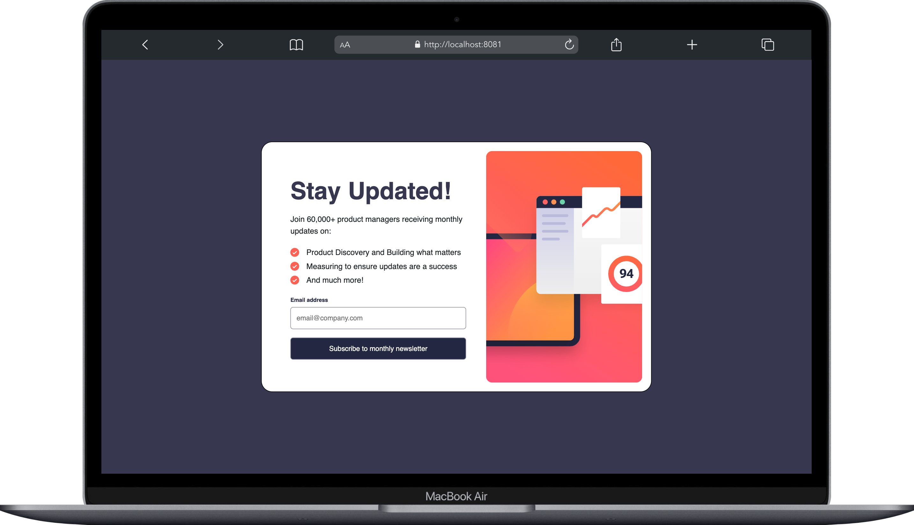
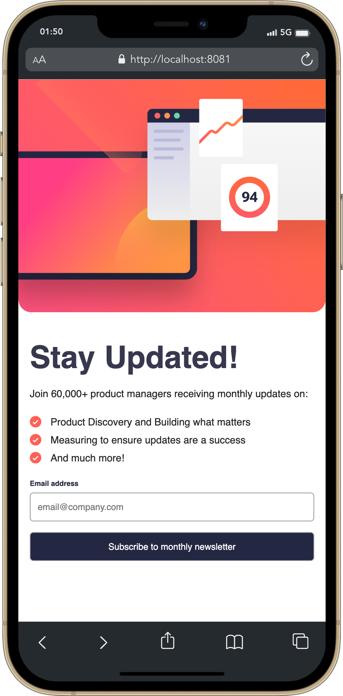
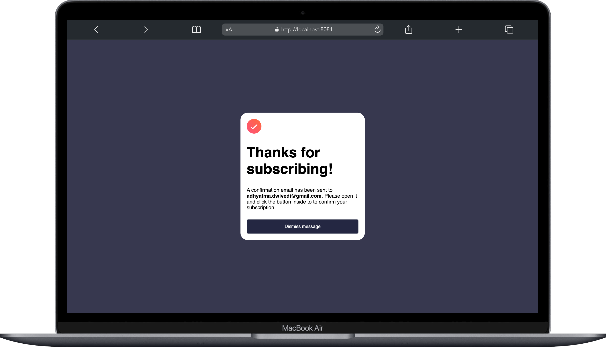
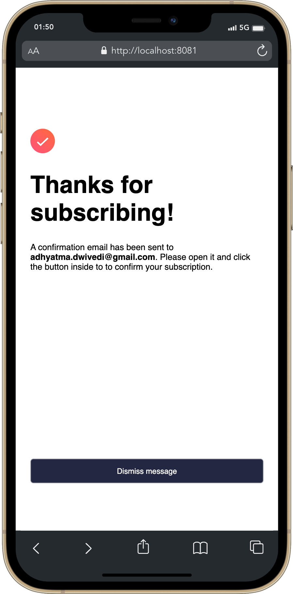

# Frontend Mentor - Newsletter sign-up form with success message

This is a solution to the [Newsletter sign-up form with success message](https://www.frontendmentor.io/challenges/newsletter-signup-form-with-success-message-3FC1AZbNrv) challenge from Frontend Mentor. Frontend Mentor challenges help you improve your coding skills by building realistic projects. 

## Table of contents

- [Overview](#overview)
  - [Screenshot](#screenshot)
  - [Links](#links)
  - [Built with](#built-with)
  - [Useful resources](#useful-resources)
- [Author](#author)
- [Acknowledgments](#acknowledgments)

## Overview

Newsletter webpage template where using enter a valid email and get a subsribtion success message. Users will be able to get different screens for mobile and desktop.
This project was provided by Frontend Mentor and developed by Adhyatma Dwivedi.

<strong>Re-coded from scrath to improve the structure and optimize the code.</strong>

### Screenshots

### Links

- Solution URL: [Github Repo](https://github.com/r00kieAd/newsletter)
- Live Site URL: [Live Site](https://r00kiead.github.io/newsletter/)

### Built with

- HTML5
- CSS
- SASS
- JQuery
- Bootstrap
- Javascript

### Useful resources
- [Bootstrap](https://getbootstrap.com/docs/5.2/getting-started/introduction/) - For styles and Layout

## Author

- Website - [Adhyatma Dwivedi](https://personal-site-b3o065boq-r00kiead.vercel.app/)
- Frontend Mentor - [@r00kieAd](https://www.frontendmentor.io/profile/r00kieAd)
- Twitter - [@adhyatmaDwivedi](https://twitter.com/adhyatmaDwivedi)

## Acknowledgments

When tried first, which was almost a year ago, had lot of difficulties maintaining the design given by frontend mentor. With the help of references and retires, was able to complete the project.

Re-coded this project from scratch after a year of practice. Definitely felt confident than last year in terms of binding everything together in a structured and optimized way. Major change is the use of sass and jquery.
